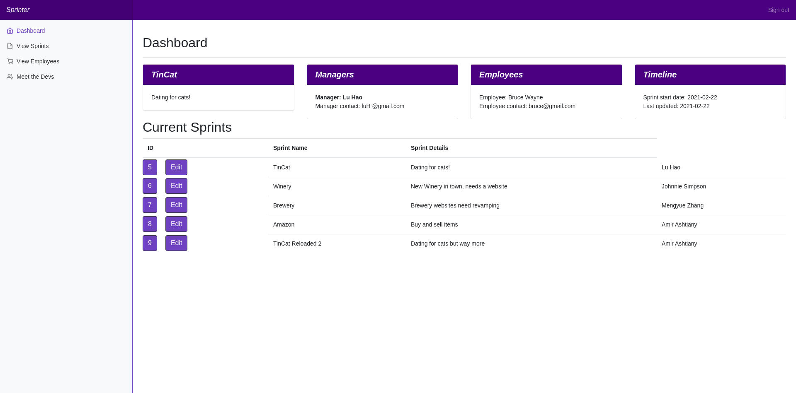
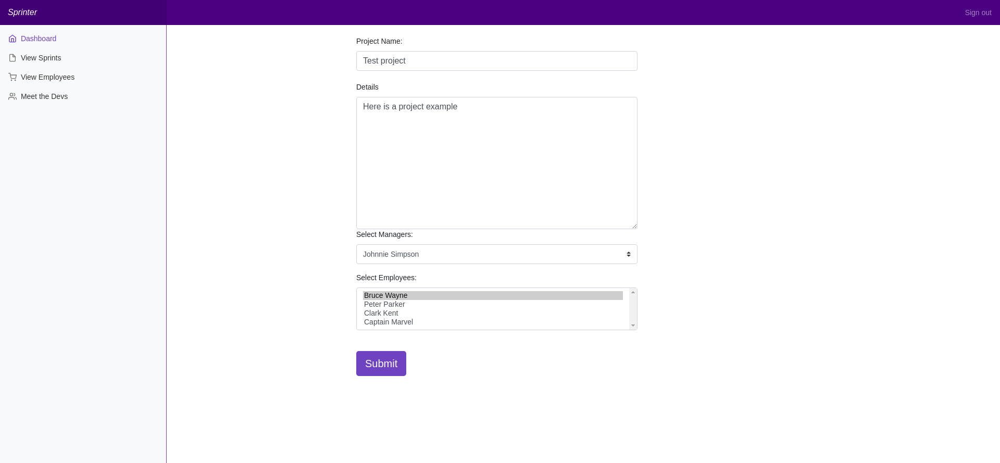
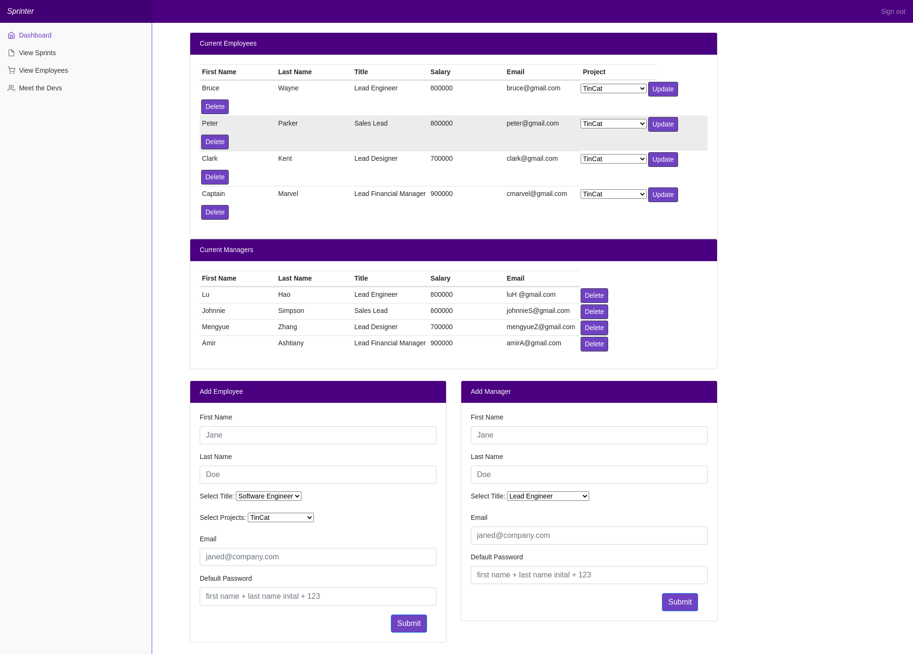

# Sprinter - A Project Management App

  

  ## Table of Contents

  - [Description](#description)

  - [Application links](#links)

  - [Screenshots](#screenshots)

  - [Developers](#developers)

  - [Usage](#usage)

  - [Contributing](#contributing)

  - [Technologies](#technologies)

  - [Questions](#questions)

  - [Licenses](#licenses)

  ## Description

  Sprinter is an application for tracking and managing developer sprints. 

  ## Links

  Github repo: https://github.com/Alexfit4/Project_Management_App 

  Deployed application: https://fast-everglades-95030.herokuapp.com/ 

  ## Screenshots

  

  

  

  

  ## Developers

  1. Lu Hao: Javascript, CSS
  2. Mengyue Zhang: Javascript, CSS
  3. Amir Ashtiany: MySQL, CRUD, Validation
  4. Johnnie Simpson: MySQL, CRUD, Handlebars, Linter

  ## Usage

  Sprinter is designed with you and your development sprints in mind. Use the app to add sprints, add employees and managers to sprints, and keep track of your progress and division of labor as your project progresses. 

  ## Contributing

  This project is free and open source software (FOSS).

  ## Technologies

  - Node.js
  - Javascript
  - MySQL
  - MySQL2
  - Sequelize
  - Handlebars
  - Express
  - HTML
  - CSS
  - Dotenv

  ## Questions

  Developer Github profiles:
  1. Amir Ashtiany: https://github.com/Alexfit4 
  2. Johnnie Simpson: http://www.github.com/balokdecoy.
  3. Lu Hao: https://github.com/lhaodev 
  4. Mengyue Zhang: https://github.com/mengyue-z 

  ## Licenses
 Licensed under [GPL v3](https://www.gnu.org/licenses/gpl-3.0)